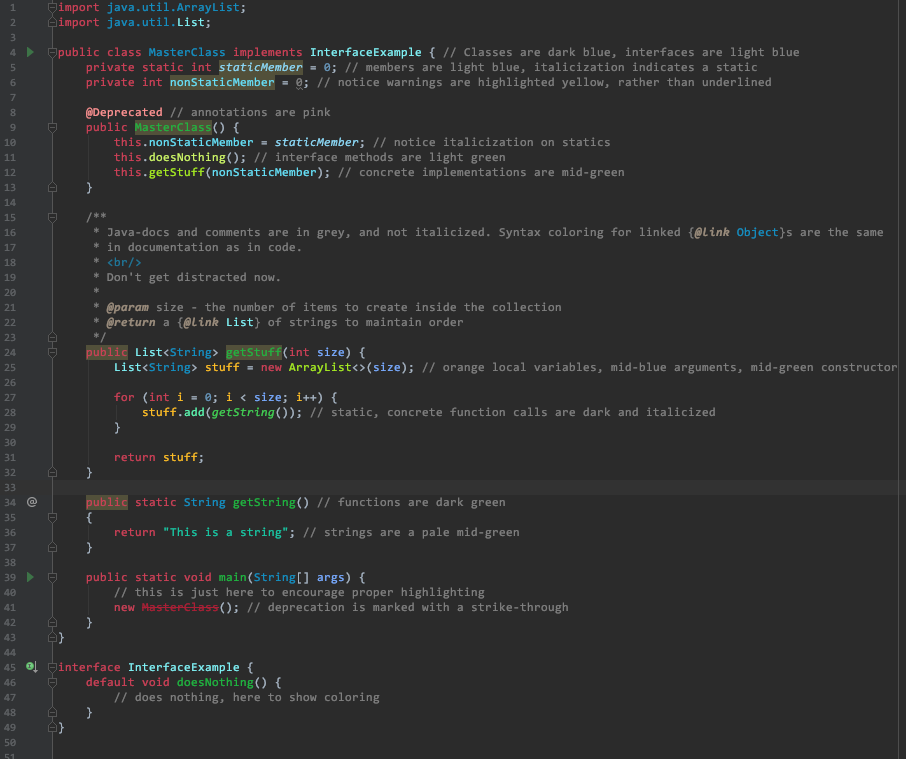

# IntellijEclipseDark
This is a theme for IntelliJ that mimics the eclipse dark theme (recommend using with Consolas). Simply download and import via the page located under Editor -> Color Scheme.

